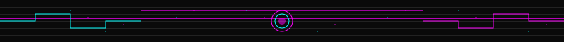

[//]: # (  )
  <h1>GUSTAVO SILVA</h1>
  <h3>FULL STACK SOFTWARE ENGINEER</h3>
  
  
  
  

## About Me

I'm a Brazilian Software Engineer passionate about creating elegant solutions for complex problems. I specialize in full-stack development with a focus on clean code, solid architecture, and exceptional user experiences.

I'm constantly learning new technologies and improving my skills to stay at the forefront of software development. I thrive in collaborative environments where I can contribute ideas and learn from others.

My problem-solving abilities, critical thinking, and attention to detail allow me to analyze complex situations and devise effective solutions.

### Quick Highlights

- 💻 Full Stack Developer with expertise in React, Node.js, and modern web technologies
- 🏗️ Advocate for clean code and solid architecture principles
- 🌱 Continuous learner, always exploring new technologies and methodologies
- 🤝 Team player who values collaboration and knowledge sharing
- 🔍 Problem solver with strong analytical skills

  

## Technologies & Skills

### Frontend Development
                

**Proficiency Levels:**
- **Advanced**: HTML5, CSS3, JavaScript, TypeScript, React, Next.js
- **Intermediate**: Angular, Redux, Tailwind CSS, RxJS, Angular Material, Headless UI, CSS Modules, TanStack Query
- **Basic**: Vue.js

### Backend Development
       

**Proficiency Levels:**
- **Advanced**: Node.js, Express, Python
- **Intermediate**: PHP, Laravel
- **Basic**: Java, Spring Boot, GraphQL

### Database & State Management
    

**Proficiency Levels:**
- **Advanced**: MongoDB, Firebase
- **Intermediate**: MySQL, PostgreSQL
- **Basic**: SQL Server

### DevOps & Cloud
      

**Proficiency Levels:**
- **Advanced**: Git, GitHub, Docker
- **Intermediate**: Vercel
- **Basic**: Kubernetes, AWS, Jenkins

### Development Tools
     

**Proficiency Levels:**
- **Advanced**: NPM, Vercel
- **Intermediate**: Jest, Webpack,ira, Swagger, Figma
- **Basic**: Vite

  

## Current Focus & Learning Path
- Testing (Jest, Cypress)
- State Management (Redux)
- Ruby on Rails

### Upcoming Studies
- AWS Services
- Big O Notation
- Clean Architecture

### Areas of Interest
- Full Stack Development
- Frontend Development
- Backend Development
- Mobile Development
- Web Design

  

## Featured Projects

| Project | Description | Technologies | Links |
|---------|-------------|--------------|-------|
| **Black Nib - Modern Blog Platform** | Full-featured blog platform built with React 18 and Node.js, featuring modern state management and server-side rendering. |     |   |
| **Punk Domus - Blog** | Blog created with Vue and Nuxt Content, featuring a minimalist and responsive design with efficient content management. |    |   |
| **Cadmo SA - Dental Clinic System** | Complete web system for a dental clinic featuring modern interface and comprehensive management capabilities. |     |  |

## Other Projects

Click to see more projects

| Project | Description | Technologies | Links |
|---------|-------------|--------------|-------|
| **ByteBabe** | Modular CLI toolkit with cyberpunk aesthetics for development workflow management. |    |   |
| **Opala Filmes** | Web platform for movie voting and sharing opinions. |     |   |
| **VChat** | Real-time chat application with secure authentication and instant messaging. |    |   |
| **FocalPoint - To-Do List** | To-Do List application with fluid navigation and optimized performance. |    |   |
| **BigbasketEccomerce** | E-commerce platform featuring modern shopping experience and responsive design. |    |   |
| **Multiform** | Multi-step form application with dynamic validation and smooth navigation. |   |   |
| **Mental Health DB** | Accessibility-focused website dedicated to Mental Health resources. |    |   |
| **Doces da Thay** | Frontend development for a dessert e-commerce platform. |    |   |
| **Coffee Website** | Responsive landing page for a coffee shop. |    |   |

 

  

## GitHub Stats & Achievements

 
GitHub Stats

        
  

   

 
Trophies

        
       
 

 
Holopin Badges

        
       
 

## Let's Connect

  
  
  

## Favorite Quote
> "Programadores e artistas são os únicos profissionais que tem como hobby a própria profissão." – Rafael Lain

  <h3>Let's build something extraordinary together.</h3>

